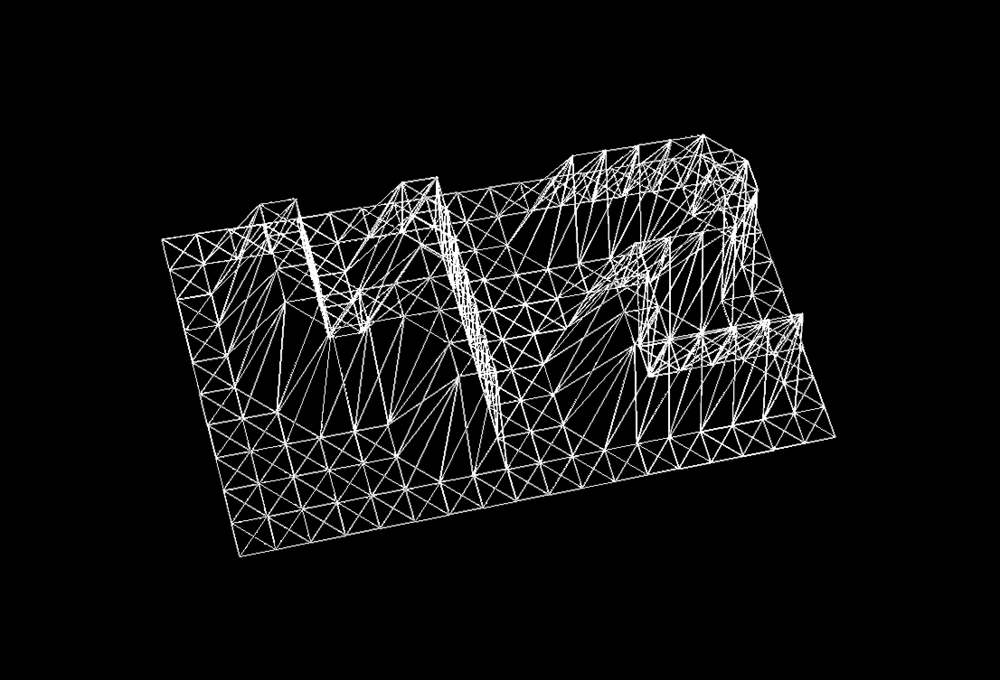

## FDF - Introduction to 3D graphics in C language (miniLibx)

#### MISSION

In this project you will learn the basics of 3D graphics using a very simplistic graphics library - **`miniLibx`**

The only graphics-related function you're provided to use is **`mlx_pixel_put`**
```c
int mlx_pixel_put ( void *mlx_ptr, void *win_ptr, int x, int y, int color );
```

However, I would highly recommend against using it but instead writing your own **`put_pixel`** function.

I will go in more details in just a couple of days.

For now, you can clone the repo and run **`make`** in the repo folder

```bash
( ~ ) fdf ) ./fdf
usage: ./fdf [source_file]
( ~ ) fdf ) ./fdf sample.fdf
```


